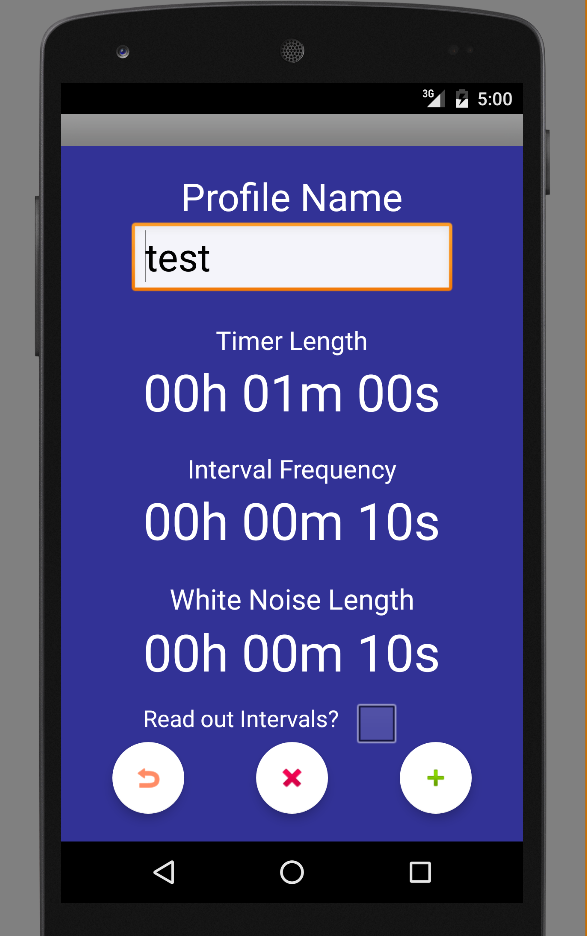
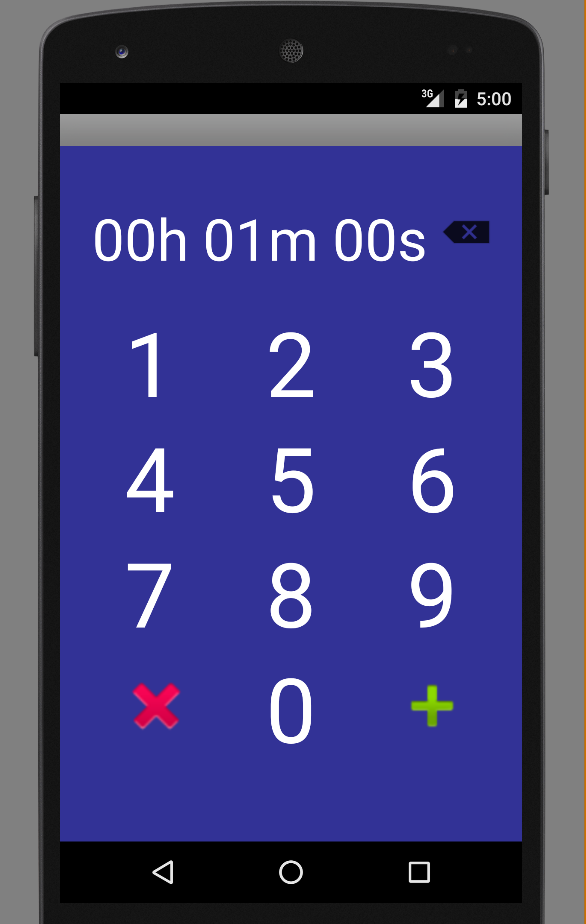
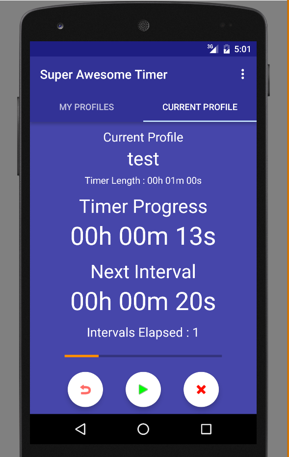

# Super Awesome Timer Android Application
An Android application I am making for a friend.
The application allows you to create timer profiles.
Each timer profile has a timer length, intervals at which white noise is played & the duration of the white noise. 
The timer will also read out a countdown before the white noise, and the current position of the timer. 
By Michael Murray 

###[The Code](Code/)

<h1>Screen Shots</h1>
<h4>Timer profiles page:</h4>

<h4>Edit timer profile page:</h4>

<h4>Edit timer inputs:</h4>

<h4>Current timer :</h4>

