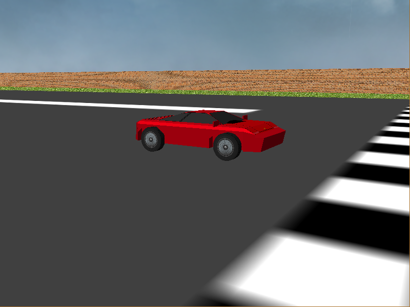
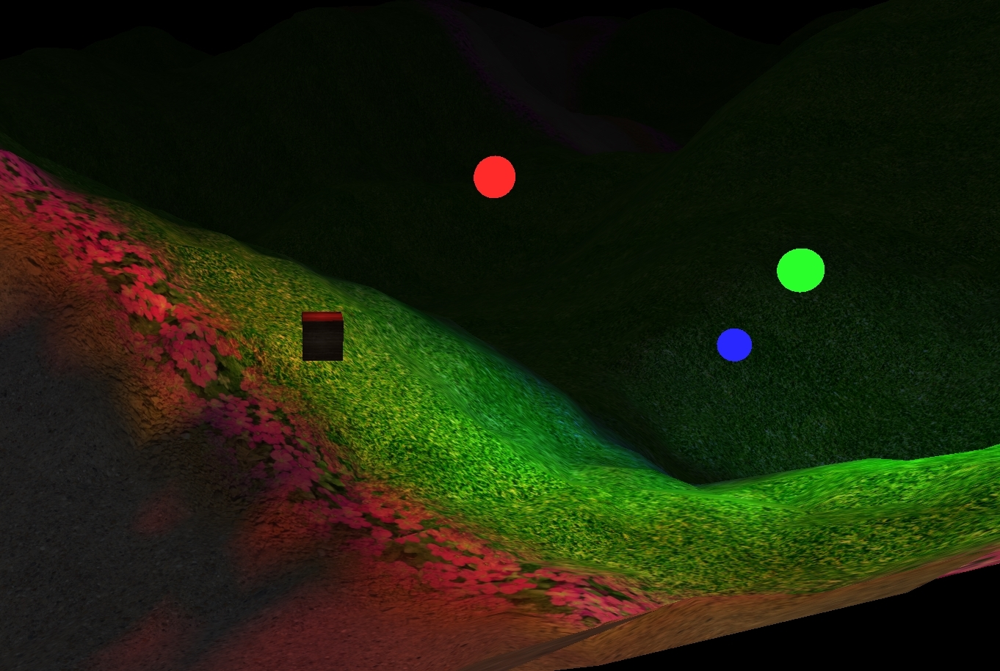
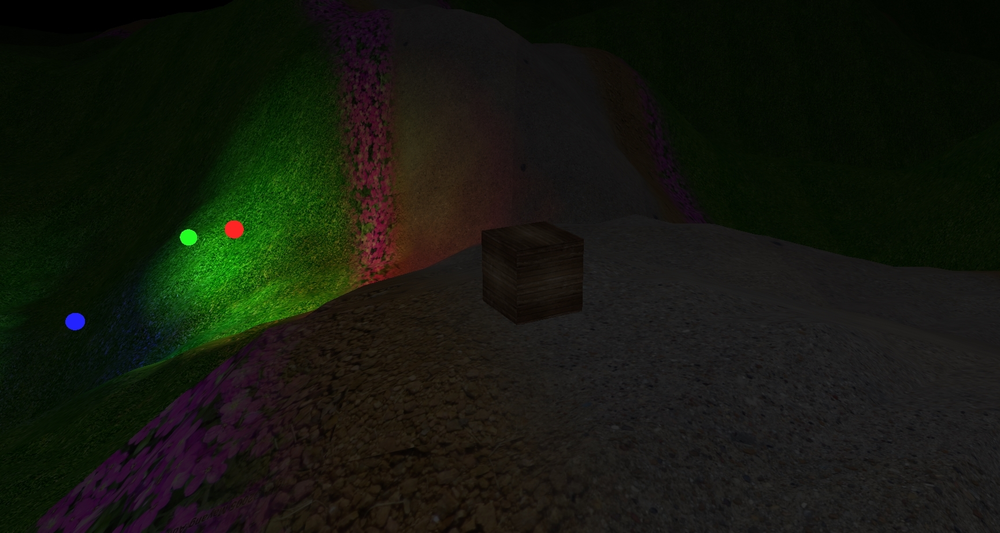
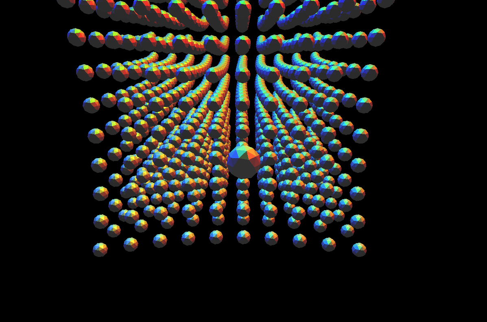
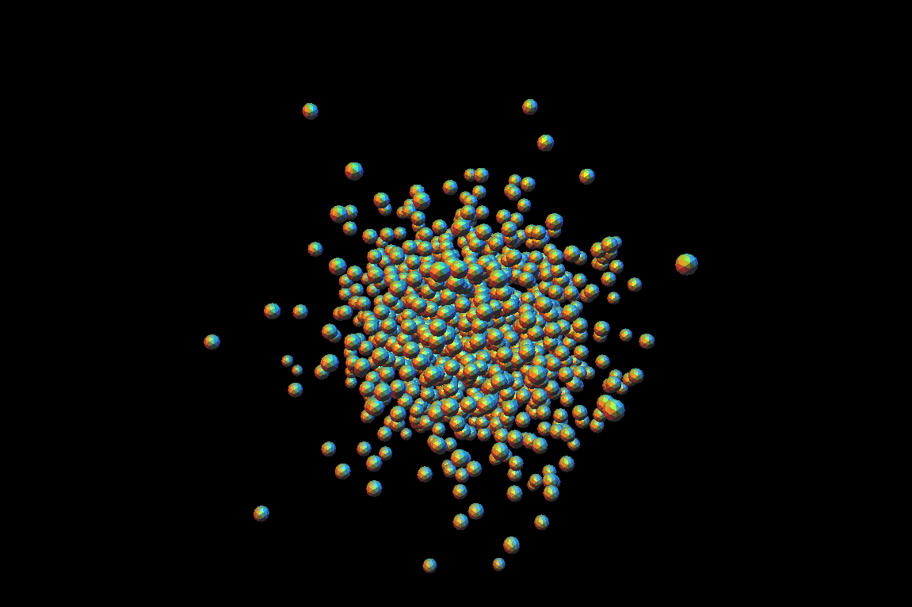

# Portfolio
A portfolio of computer graphics projects

##Contents:
<ul>
<li>Racing Game: A game I made in a second year Computer Graphics module using basic OpenGL and Java.</li>
<li>Advanced OpenGL Scene: An advanced OpenGl project I made  using LWJGL to show a 3D environment based on the thinMatrix youtube tutorials.</li>
<li>Gravity & Collision Simulation : A simulation using icosahedrons to show objects collision and gravity in space, uses Advanced OpenGL Scene as a base. </li>
</ul>
##Racing Game
Uses basic OpenGL to create a racing game
###[The Code](https://github.com/BombayCinema/Portfolio/tree/Racing-Game)
###Demonstration

###Screen Shots

##Advanced OpenGL Scene
###[The Code](https://github.com/BombayCinema/Portfolio/tree/Advanced-OpenGL-Scene)
###Demonstration

###Screen Shots

##Gravity & Collision Simulation
###[The Code](https://github.com/BombayCinema/Portfolio/tree/Gravity-Simulation)
###Demonstration

###Screen Shots

