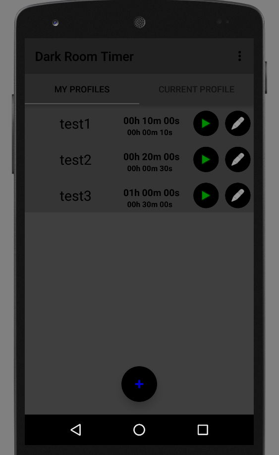
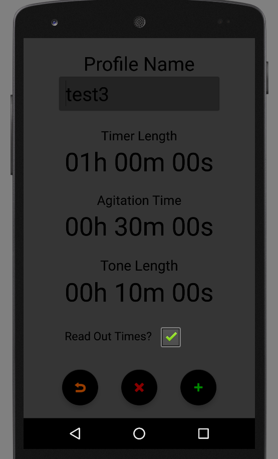
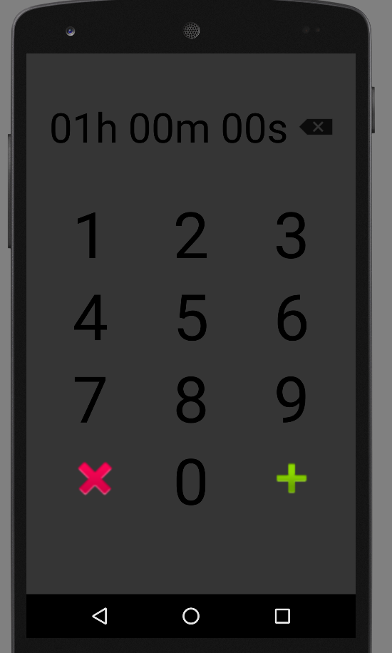
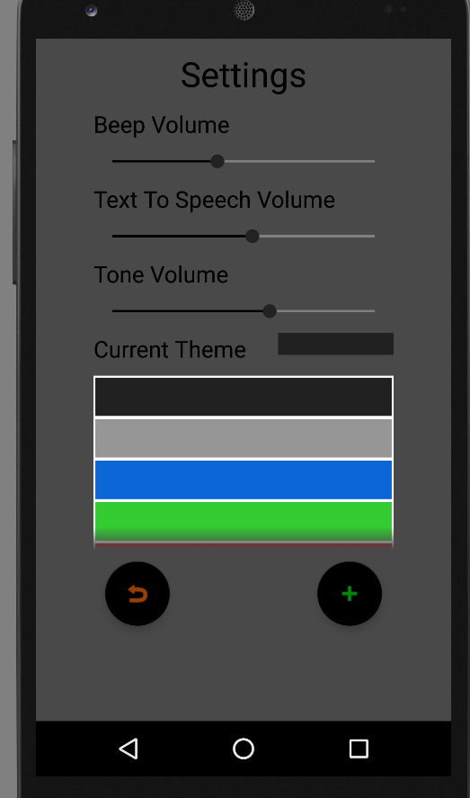

# Dark Room Timer Android Application
An Android application I made for a friend using Java and XML in Android Studio.
The application allows you to create timer profiles.
Each timer profile has a timer length, agitation intervals at which a tone noise is played for a duration. 
The timer also beeps every second, 3 seconds before the interval and reads out a current time before the tone noise.
I used dark colours so that the app can still be used within a dark room without ruining and photos.
The theme and volumes can also be changed in the settings 
By Michael Murray 

###[The Code](Code/)

<h1>Screen Shots</h1>
<h4>Timer profiles page:</h4>

<h4>Edit timer profile page:</h4>

<h4>Edit timer inputs:</h4>

<h4>Current timer :</h4>

<h4>Settings :</h4>

